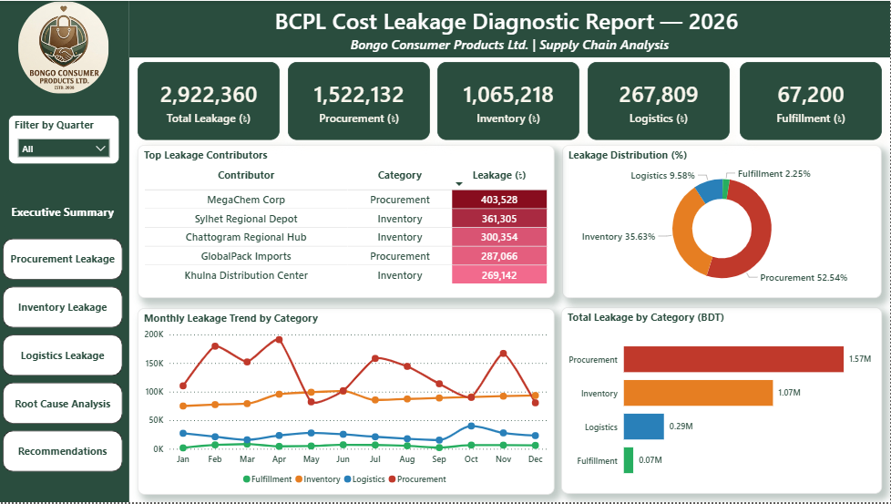
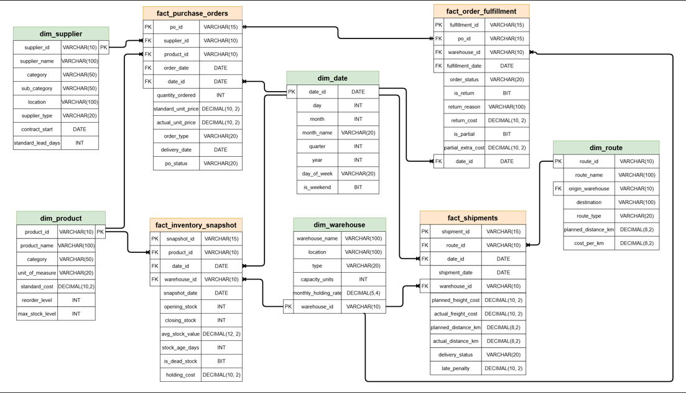

# 🔍 BCPL Supply Chain Cost Leakage Diagnostic & Recovery Plan

> End-to-end supply chain cost leakage analysis for a fictional Bangladeshi FMCG company — identifying ৳29.22 lakh in hidden costs across Procurement, Inventory, Logistics, and Fulfillment, with a prioritized recovery action plan projecting ৳15.93 lakh in potential annual savings.

---

## 🏢 Project Overview

Bongo Consumer Products Ltd. (BCPL) is a fictional Bangladeshi FMCG company facing rising supply chain costs with no clear visibility into root causes. This project builds a complete cost leakage diagnostic framework — from raw data generation to an executive-ready Power BI dashboard and recommendation report.

---

## ❓ Business Problem

> *"BCPL's supply chain cost has grown 18% over the past year, while revenue grew only 7%. Management suspects leakage across multiple functions — but cannot pinpoint where, or what to do about it."*

---

## 🛠️ Tech Stack

| Tool | Purpose |
|---|---|
| **Python** (pandas, numpy, faker) | Data generation, messiness injection, cleaning pipeline, validation |
| **SQL Server + T-SQL** | Star schema design, data load, 7 analytical views |
| **Power BI + DAX** | 6-page interactive dashboard |
| **Excel** | QA spot-check |

---

## 🗂️ Project Structure

```
bcpl-supply-chain-cost-leakage-diagnostic/
├── 01_database_design/    # ER diagram + data dictionary
├── 02_python/             # Data pipeline scripts
├── 03_sql/                # CREATE TABLE + 7 analytical views
├── 04_data/
│   ├── raw/               # Messy CSVs (pre-cleaning)
│   └── cleaned/           # Clean CSVs (SQL-ready)
├── 05_powerbi/            # Dashboard (.pbix) + dashboard images
└── 06_docs/               # Data cleaning summary
```

---

## 🔍 Key Findings

- 💰 **Total leakage identified: ৳29.22 lakh** across 4 supply chain categories
- 📦 **Procurement (52.54%)** — 3 import suppliers (MegaChem Corp, GlobalPack Imports, AsiaFood Commodities) responsible for 59.24% of procurement leakage via consistent price overcharging
- 🏭 **Inventory (35.63%)** — 23.3% of stock flagged as dead stock; Packaged Food drives 49.88% of dead stock leakage; Sylhet depot worst offender (৳3.61 lakh)
- 🚚 **Logistics (9.58%)** — Sylhet Tea Belt: 40% late delivery rate, 32.83% avg freight overrun; Khulna–Jessore Belt: highest penalty cost (৳28,500)
- 📋 **Fulfillment (2.25%)** — 10.7% order error rate; partial shipments (৳52,800) larger than returns (৳14,400)
- 🎯 **80/20 confirmed** — Top 3 suppliers = 59% of procurement leakage; Top 3 routes = 76% of logistics leakage

📄 **[Read the full Insight Report →](./INSIGHT_REPORT.md)**

---

## 💡 Recommendations Summary

| Priority | Action | Category | Est. Saving |
|---|---|---|---|
| 1 | Re-negotiate MegaChem Corp contract | Procurement | ৳2,41,000 |
| 2 | Dual-source GlobalPack Imports | Procurement | ৳1,72,000 |
| 3 | Demand forecasting — Sylhet depot | Inventory | ৳1,80,000 |
| 4 | Route optimization — Sylhet Tea Belt | Logistics | ৳34,000 |
| 5 | Renegotiate AsiaFood Commodities | Procurement | ৳1,44,000 |
| 6 | SKU rationalization — Packaged Food | Inventory | ৳1,50,000 |
| 7 | Carrier review — Khulna–Jessore Belt | Logistics | ৳32,000 |
| | **Total Estimated Recovery** | | **৳9,53,000** |

---

## 📊 Dashboard Preview

**Page 1 — Executive Summary**
<p align="center">
  
</p>

📸 See [`all_dashboard_images`](06_powerbi/dashboard_image) for full-page captures of each dashboard view.

---

## 🗄️ Database Design

<p align="center">
  
</p>

---

## ⚠️ Assumptions & Limitations

- All data is synthetically generated for portfolio demonstration purposes
- Cost assumptions (holding rate 2%, late penalty ৳500/shipment, return cost ৳300/order) are illustrative estimates
- Savings projections assume 50–60% recovery of identified leakage — actual outcomes depend on negotiation results and operational changes
- Analysis covers January–December 2025 only

---

## 🚀 How to Reproduce

```bash
# 1. Clone the repo
git clone https://github.com/quietwithsuborno/supply-chain-cost-leakage-and-recovery

# 2. Install dependencies
pip install -r 03_python/requirements.txt

# 3. Run full data pipeline
python 03_python/main.py

# 4. Load to SQL Server
python 03_python/02_bulk_insert.py

# 5. Open Power BI dashboard
# Open 06_powerbi/bcpl_cost_leakage_dashboard.pbix
```

---

*This project was built as part of a data analytics portfolio. All company names, figures, and scenarios are fictional.*
